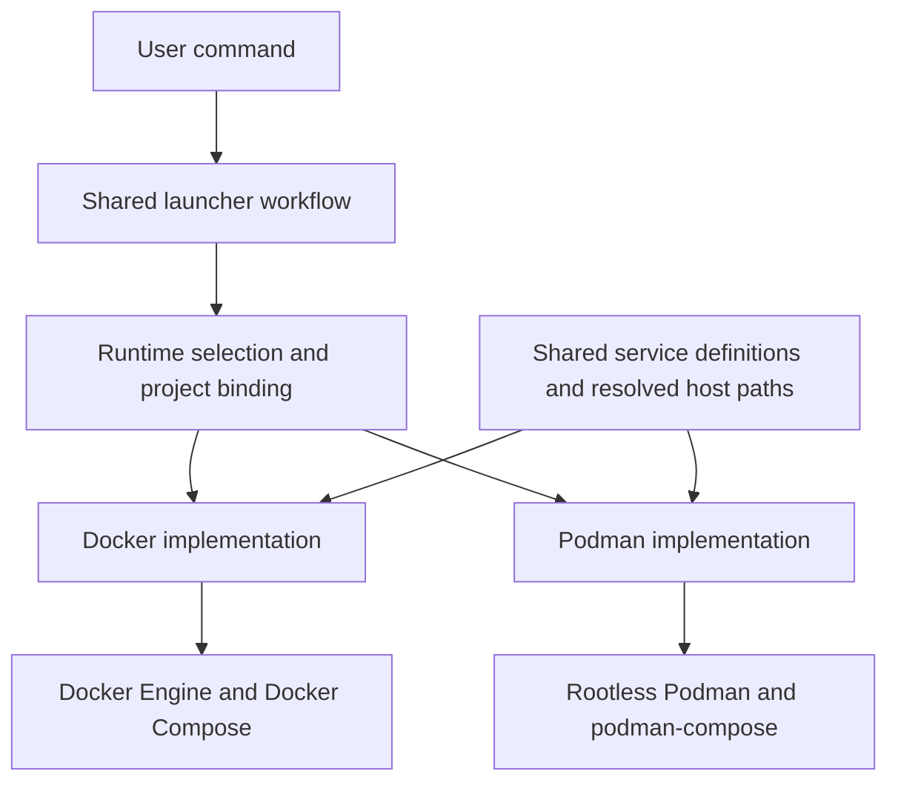

# OpenCode Launcher: Docker and Podman architecture

Architecture decision · 23 September 2026

The runtime separation, shared configuration assembly, persistent bindings,
preflight checks and lifecycle routing described here are implemented in this
branch. [Runtime support and validation](RUNTIMES.md) records the delivered
scope and remaining release acceptance work. In particular, service mounts use
`create_host_path: true` with explicit source checks because Docker's alternate
mount API loses SELinux relabeling; a real Docker test verified that tradeoff.
The acceptance matrix below remains the release target, not a claim that every
combination has been tested.

**The launcher should provide one consistent user experience through two separate runtime implementations.** Project configuration, credentials, prompts, terminal behavior, and lifecycle decisions remain shared. Docker and Podman each receive a small implementation responsible for running containers and handling their own compatibility requirements.

The main change belongs in OpenCode Launcher. OpenCode Setup continues to produce shared container images, with an explicit startup contract that both runtimes must satisfy.

**The current coupling is broader than the startup command.** Docker commands appear in installation checks, startup, image inspection, diagnostics, terminal attachment, status, logs, and shutdown. Compose commands are assembled in multiple places. Adding another conditional at startup would leave these other paths inconsistent. The existing tests also simulate Docker, so they cannot establish that real Podman mounts, networking, or startup work.

This proposal addresses that coupling. A machine-specific filesystem permission failure still requires diagnosis on the affected host; runtime separation does not itself repair host permissions.

**The architecture has three clear responsibilities.**

| Component | Owns |
|---|---|
| Shared launcher | User configuration, credential handling, project identity, port allocation, path resolution, optional features, attachment tracking, and decisions about when to start or stop |
| Runtime interface and selection | Runtime choice, saved project binding, common operation contracts, and loading the selected implementation |
| Docker implementation | Docker commands, Docker Compose invocation, daemon checks, image/container inspection, and Docker-specific diagnostics |
| Podman implementation | Podman commands, the supported Compose provider, rootless checks, user-namespace settings, and Podman-specific diagnostics |
| Shared service configuration | OpenCode, Squid, the publisher sidecar, network boundaries, storage destinations, and common environment settings |
| OpenCode Setup images | Application installation, Squid configuration, initialization, and the final transition to the non-root application user |

Proposed implementation files are `lib/runtime.sh`, `lib/runtime/docker.sh`, and `lib/runtime/podman.sh`. Existing feature modules remain shared and call the runtime interface. Only runtime-specific modules invoke engine or Compose executables. Runtime selection performs discovery through those modules as well.

**The interface should describe operations the launcher needs.** It should cover environment validation; image inspection, pulling and optional building; starting a stack and checking readiness; project discovery and status; logs; interactive and non-interactive command execution; and shutdown.

Each implementation returns results in the same internal format. Shared code does not parse Docker output or construct provider-specific flags. A single command cannot mix engines—for example, pulling through Docker and attaching through Podman.

Execution must preserve the launcher's existing behavior: exit codes, signals, terminal attachment, piped input, and clean stdout for `--exec`. The shared attachment registry continues to decide when the last terminal has exited and whether the stack should remain running.

**The initial support scope should be deliberately small.**

| Supported target | Container engine | Compose implementation |
|---|---|---|
| Existing Docker experience | Local Docker Engine on Linux | Docker Compose |
| New Podman experience | Local rootless Podman on Linux | An explicitly selected and tested `podman-compose` version range |

Minimum supported versions are established by integration tests before release. Rootful Podman, remote engines, Podman virtual machines, and alternative engine/provider combinations are outside the first validated release scope.

Engine and Compose provider are separate choices internally. `podman compose` delegates to an external provider, and its default can change depending on which providers are installed. The Podman implementation must therefore invoke the chosen provider explicitly or configure it explicitly for the invocation. It must not depend on incidental provider discovery. [Podman Compose documentation](https://docs.podman.io/en/latest/markdown/podman-compose.1.html)

**Runtime selection should be predictable and persistent.** For a new project, an explicit `--engine docker` or `--engine podman` takes precedence over a configured default. The existing `--podman` flag becomes an alias for selecting the Podman implementation. Without a selection, prefer Docker when installed to preserve existing behavior; select Podman automatically only when it is the sole available supported engine.

Discovery must identify the backend actually reached, rather than relying on the name of the executable or its client version string. A Docker command that is a Podman shim, or a Docker client connected to a Podman service, must not be mistaken for Docker Engine.

Once a project is bound to a runtime, later commands use that binding. A conflicting explicit selection produces a clear explanation and requires a deliberate change after the old stack is stopped. A connection failure never causes an automatic switch to another engine.

The saved binding includes the engine, Compose provider, connection identity, execution mode and user where relevant, project name, and effective configuration references. It contains no credentials. Record it atomically before creating resources so a partially failed startup can still be inspected and cleaned up through the correct runtime. Serialize conflicting lifecycle operations for the same project.

Docker and Podman keep separate image and volume stores. Switching a project does not transfer its session data. Data migration is a separate operation, outside this refactor. Initially, allow one active runtime binding per project rather than simultaneous Docker and Podman instances sharing launcher state.

**Compose configuration should remain shared where behavior is shared.** Keep one base service definition and small Docker and Podman overlays. Existing feature overlays—such as the user configuration layer, additional folders, and extra packages—continue to be applied through one shared configuration assembly path.

The base and feature definitions should use syntax validated against both supported providers. If a provider needs a different representation, translate that detail inside its implementation or overlay. Business rules such as credential precedence and network isolation remain shared. Separate complete Compose definitions can be considered later if the differences become substantial.

**Host paths must be resolved before Compose is invoked.** The shared layer produces absolute locations for the workspace, additional folders, shared and per-project environment files, allowlist directory, user configuration layer, package-build context, and generated files. Relative user settings resolve against a documented base, normally the launcher root; feature-specific paths retain their existing documented meaning. Dockerfile references are resolved consistently against the selected build context.

Both providers must receive equivalent effective paths, regardless of the shell's working directory or where Compose files live. Existing project names and saved volume identities must survive this change.

The implementation should remove its dependency on `--project-directory`. Removing the flag alone is insufficient: without it, relative paths can resolve against the directory containing the first Compose file. Docker documents this behavior, while upstream `podman-compose` currently has an open request for the flag. [Docker Compose path rules](https://docs.docker.com/reference/cli/docker/compose/), [podman-compose support request](https://github.com/containers/podman-compose/issues/542)

Mount validation checks that each configured source exists, has the expected file or directory type, and is accessible to the invoking user. A small runtime probe is needed to establish engine-side access; a successful local filesystem check is not enough. Explicitly configured missing paths should fail clearly. The launcher may create only its own documented managed directories.

**The images must have an explicit initialization contract.** The OpenCode image initializes accounts, configuration, and managed state as container root, then drops privileges to `dev`. Docker and Podman must both honor this sequence.

For rootless Podman, the initial design retains `keep-id` and explicitly starts the entrypoint as container user `0:0`. Root here is inside the user namespace. This addresses the fact that `keep-id` otherwise changes the initial process user. The full combination must be tested with the actual image and Compose provider. [Podman user-namespace documentation](https://docs.podman.io/en/latest/markdown/podman-run.1.html#userns-mode)

Ownership handling should preserve the user's repository. Initialization should operate on managed configuration and state where necessary, and verify workspace access without using blanket recursive ownership changes as a compatibility workaround.

Squid's optional allowlist directory must contain a harmless `.conf` placeholder when otherwise empty. The launcher should ship that placeholder, matching OpenCode Setup. An explicitly selected custom allowlist directory must be validated too.

**The runtime split must preserve the existing network boundary.** OpenCode stays on internal networks, permitted outbound traffic goes through Squid, and the publisher exposes the intended loopback ports. Podman's deployment must preserve the separation between services instead of accidentally placing them in a shared network namespace that changes this boundary. Runtime tests must verify both permitted proxy traffic and rejection of direct outbound access.

**Startup and management should use the same saved project configuration.** The shared startup sequence is:

1. Load the user's settings and existing project binding.
2. Select and validate the engine and Compose provider.
3. Resolve paths and assemble the effective service configuration.
4. Validate mounts, ports, identity requirements, and configuration compatibility.
5. Save the runtime binding and configuration references.
6. Pull or build the required images, then start the stack.
7. Check readiness and attach the requested interface or execute the one-shot command.

Logs, status, terminal attachment, and shutdown reuse this binding. They do not rerun automatic runtime selection or silently reconstruct a different set of overlays. Optional capabilities that are unavailable—such as a package-build feature on an unvalidated provider version—must be reported before startup rather than silently ignored.

**Diagnostics should identify the stage that failed.** The doctor command reports the selected engine and provider, versions, endpoint, rootless status where relevant, and resolved mount paths. Errors distinguish engine connection failures, unsupported Compose arguments, host mount failures, container initialization failures, and application readiness failures. Keep original runtime error details available without printing credentials.

Generic advice such as adding a Docker group membership should be limited to the applicable Docker connection failure. A source-directory permission failure requires filesystem-specific guidance.

**Delivery should proceed in stages with a working Docker path at each step.**

| Stage | Deliverable | Completion check |
|---|---|---|
| 1. Capture current behavior | Regression coverage for Docker launch, attach, exec, status, logs, shutdown, and persistence | Existing behavior and resource names are recorded |
| 2. Extract Docker operations | Runtime interface and Docker implementation; shared callers use the interface | Existing tests pass and real Docker startup succeeds |
| 3. Unify configuration | One overlay assembly path, explicit host paths, persistent runtime binding | Launching from different directories resolves the same resources |
| 4. Implement Podman | Podman implementation, explicit provider selection, rootless validation, image initialization adjustments | Real rootless Podman startup and lifecycle tests pass |
| 5. Validate and release | Compatibility matrix, migration handling, diagnostics, and user documentation | Both supported configurations pass the same acceptance scenarios |

Adopt existing projects without changing their names or volumes. For projects with no saved binding, discover matching stacks on available supported engines and verify ownership before recording a binding. If discovery is ambiguous or an engine cannot be checked, require explicit selection rather than guessing or creating a duplicate stack.

**Acceptance requires real containers as well as unit tests.** Test both supported configurations for a fresh launch; readable allowlists; workspace access with ordinary and non-default UIDs; configuration and state persistence; optional user layers, packages, and additional folders; logs and shell access; multiple attached terminals; piped `--exec` input and exit codes; interruption and failed-start recovery; and shutdown through the saved runtime.

Also verify that unsupported arguments never reach the selected provider, engine outages do not trigger fallback, paths containing spaces survive configuration generation, secrets stay out of diagnostics, host file ownership is preserved, and the network boundary behaves as intended. Include an enforcing SELinux host in the integration matrix. Existing simulated-command tests remain useful for control flow, but passing them alone is not evidence of runtime compatibility.

The release is ready when a user can select Docker or Podman once and use the same launcher features and lifecycle commands reliably, with any unsupported combination identified before resources are created.
